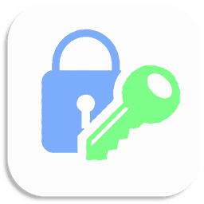

<p float="left">
<a href="../../"></a>
<a href="https://www.codacy.com/manual/FredHappyface/Python.PasswordVault"></a>
<a href="https://www.codacy.com/manual/FredHappyface/Python.PasswordVault"></a>
<a href="../../"></a>
<a href="../../issues"></a>
<a href="/LICENSE.md"></a>
<a href="../../commits/master"></a>
<a href="../../commits/master"></a>
</p>


# Python.PasswordVault




PasswordVault is a proof of concept password vault in python using One Time Pad
encryption. It uses the master password to encrypt passwords that the user 
enters. Bear in mind that this is a proof of concept program and therefore 
should not be used as you password manager. If you are looking for one of 
them, there are plenty to choose from on the web...


## Download
### Clone
#### Using The Command Line 
1. Press the Clone or download button in the top right
2. Copy the URL (link)
3. Open the command line and change directory to where you wish to clone to
4. Type 'git clone' followed by URL in step 2
```bash
$ git clone https://github.com/[user-name]/[repository]
```

More information can be found at 
<https://help.github.com/en/articles/cloning-a-repository> 

#### Using GitHub Desktop
1. Press the Clone or download button in the top right
2. Click open in desktop
3. Choose the path for where you want and click Clone

More information can be found at 
<https://help.github.com/en/desktop/contributing-to-projects/cloning-a-repository-from-github-to-github-desktop>

### Download Zip File

1. Download this GitHub repository
2. Extract the zip archive
3. Copy/ move to the desired location


## Language information 
### Built for
This program has been written for Python 3 and has been tested with 
Python version 3.7.0 <https://www.python.org/downloads/release/python-370/> 
on a Windows 10 PC. 
### Other versions
To install Python, go to <https://www.python.org/> and download the latest 
version. 
## How to run
1. Open the .py file in IDLE
2. Run by pressing F5 or by selecting Run> Run Module


## How to use the program
PasswordVault has been written in Python 3.6 but should work in all versions 
of Python 3 (however, it will not work in (Python 2). The program runs in the 
command window (or IDLE) - it is therefore text based. Enter your master 
password (when you first run the program copy the one it gives you - for 
subsequent times, ignore it). Then enter single characters to add a password, 
remove a password, show passwords or quit the program 

*   Add password - A (Default option)
*   Remove password - r
*   Show passwords - s
*   Quit        -    q


## General Code Overview
Import sys to exit the program, random to generate a master key and io to read 
and write to files

Global list containing encrypted passwords and key 

masterPassword for the example text file containing passwords "hello" and 
"why" - I advise you choose better passwords for sites!
masterPassword = ,B3U*]Y)gO'aC(B|gGx1

start() Opens the password file and writes each password to the passwords list 
then promps the user to enter their master password 

choice() Prompts the user to choose what they want to do next (default is Add 
Password) - "Add Password, Remove Password or Show Passwords or Quit? 
(A/r/s/q)"

myquit() Writes the passwords to the password file and exits the program (save 
and quit)

remove() Shows the passwords, Prompts the user to select the index that they 
wish to remove and then removes that password, and finally shows the updated 
passwords

encrypt() Takes a password, encrypts it using the master password and writes 
it to the passwords list 

decrypt() Runs decrypt_part (the bit that actually decrypts and then 
choice()) - not particularly good but saved me rewriting code 

decrypt_part() Takes all encrypted passwords from the list, decrypts and prints
them (password list stays encrypted)
    
genMasterPassword() Generates the master password (20 characters long)

start() Starts the program 


## Licence 
MIT License
Copyright (c) fredhappyface
(See the [LICENSE](/LICENSE.md) for more information.)

